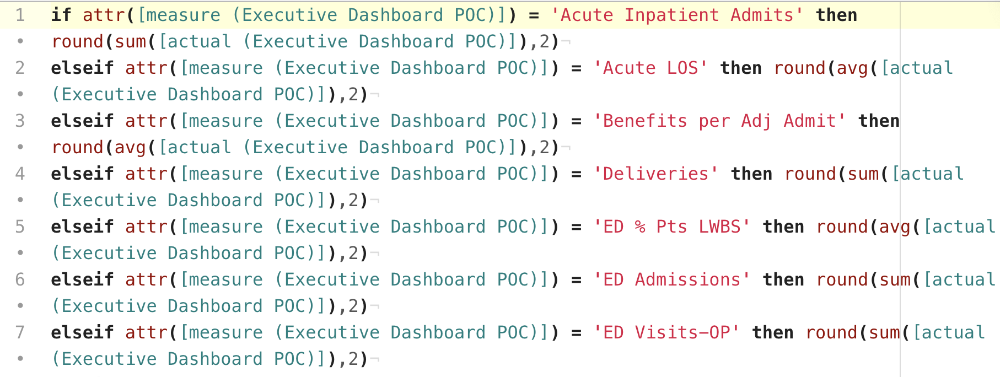

# tableau-calcs package

A small package to provide syntax coloring for Tableau Calculations.

Inspired by: https://davidvelleca.com/posts/archive/20190129%20Tip-Notepad++%20Tableau%20Calcs

Notepad++ is one of the few things that I prefer on Windows. Maybe it's just years of experience. Thankfully, Atom is growing on me.

